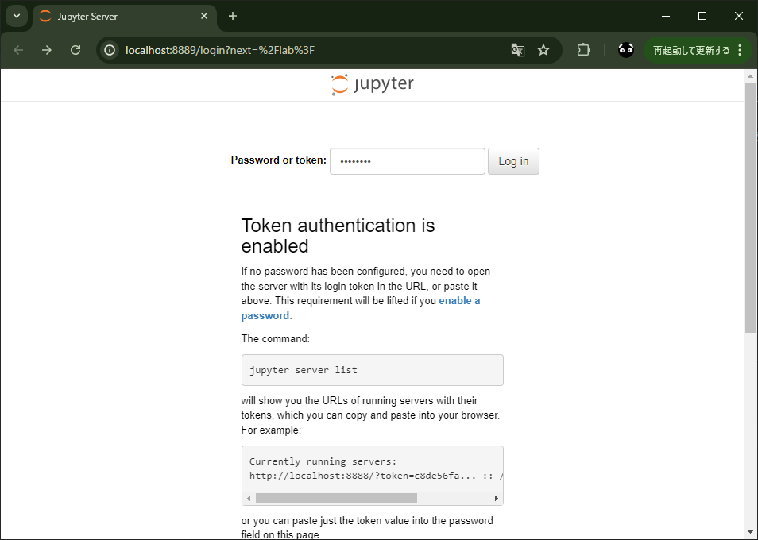
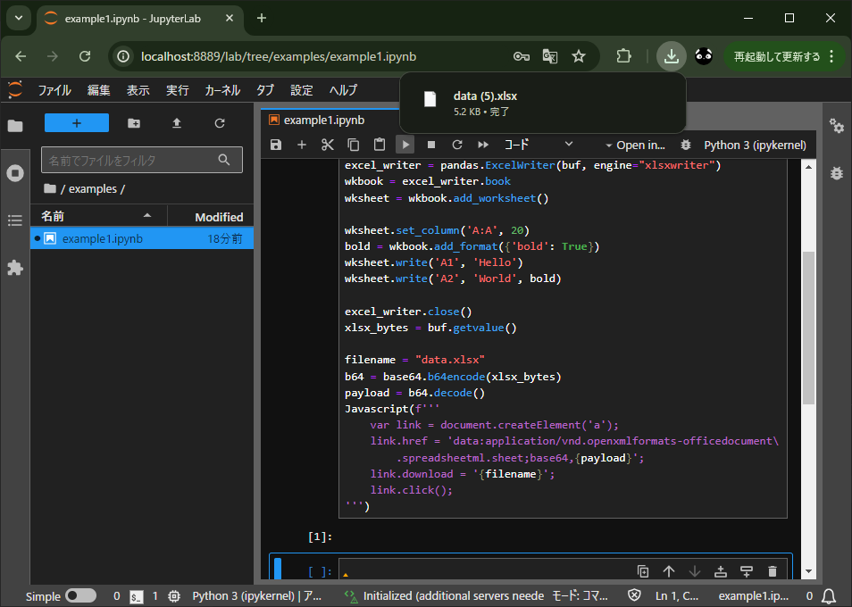

# docker_jupyter_lab

## 概要
* Docker Compose で JupyterLab をお手軽に構築
* 日本語化など好みの設定をデフォルトに

※以下は Python に関する自分のナレッジベース (使えるものもあるかも？)  
　[Tobotobo/my_knowledge_base/labels/Python](https://github.com/Tobotobo/my_knowledge_base/labels/Python)

## 起動
* `docker compose up` ※自分の環境に合わせて
* `http://localhost:8889` ※自分の環境に合わせて
* 初回はトークンを聞かれるので `my-token` と入力 ※ compose.yml で変更可
  
* ログインするとデフォルトで日本語化+ダークテーマ  
  
* 後はお好みで ※以下は examples の実行例
  

## メモ

### 構築時点でパッケージをインストールしておきたい
Dockerfile の pip install を追加・変更する。

### 設定を永続化したい
`/home/jovyan/.jupyter/lab/user-settings` から引っこ抜く。

## 参照
* [docker docs - Data science with JupyterLab](https://docs.docker.com/guides/use-case/jupyter/)  
* [RED HAT Quay.io - Minimal Jupyter Notebook Stack](https://quay.io/repository/jupyter/minimal-notebook)  
* [GitHub - Jupyter Docker Stacks](https://github.com/jupyter/docker-stacks)  
* [初心者によるJupyterLabの拡張機能であるJupyterlab-lspの設定](https://zenn.dev/nobunaga_takeru/scraps/807ac529047d4f)